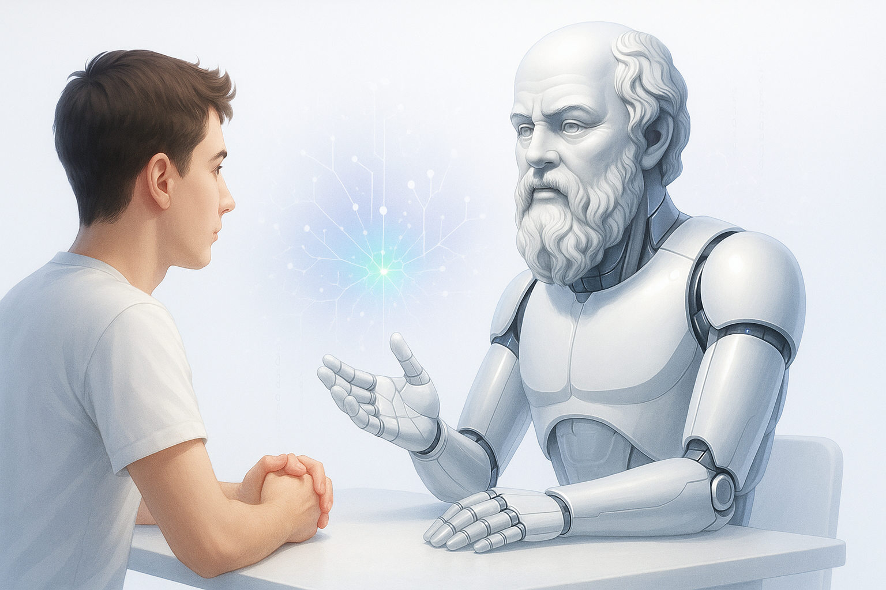

<p align="center">
  
</p>

# 🧠 Sokrates - Twój cyfrowy nauczyciel 🤖


> *"Wiem, że nic nie wiem"* - Sokrates

🧠 Sokrates - Twój cyfrowy nauczyciel 🤖 to inteligentna aplikacja nauczająca wykorzystująca metodę sokratejską. Zamiast podawać gotowe odpowiedzi, prowadzi uczniów do samodzielnego odkrywania wiedzy przez przemyślane pytania prowadzące.

## ✨ Funkcje

### 🎯 Metoda Sokratejska
- **Pytania prowadzące** zamiast gotowych odpowiedzi
- **Progresywny system pomocy** z licznikiem "nie wiem" (0-4)
- **Personalizowane nauczanie** dostosowane do stylu uczenia się

### 👤 Profile Uczniów
- **Indywidualne konta** z osobną pamięcią dla każdego ucznia
- **Automatyczne wykrywanie** faktów o stylu nauki
- **Lokalne przechowywanie** danych zgodnie z RODO

### 💡 Inteligentny System Pomocy
- **0-2 "nie wiem"**: Tylko pytania prowadzące
- **3 "nie wiem"**: Wskazówki i częściowe odpowiedzi
- **4+ "nie wiem"**: Pełna odpowiedź z wyjaśnieniem
- **Przycisk "Udziel odpowiedzi teraz"** do omijania procesu

### 📊 Monitoring i Analityka
- **Śledzenie kosztów** API w PLN
- **Historia nauki** z możliwością edycji
- **Przejrzysty interfejs** z intuicyjną nawigacją

## 🚀 Szybki Start

### Wymagania
- Python 3.8+
- Klucz API OpenAI
- Streamlit

### Instalacja

1. **Sklonuj repozytorium:**
```bash
git clone https://github.com/AlanSteinbarth/Sokrates.git
cd Sokrates
```

2. **Zainstaluj zależności:**
```bash
pip install -r requirements.txt
```

3. **Skonfiguruj zmienne środowiskowe:**
```bash
cp .env.example .env
# Edytuj .env i dodaj swój klucz OpenAI API
```

4. **Uruchom aplikację:**
```bash
streamlit run app.py
```

5. **Otwórz w przeglądarce:**
```
http://localhost:8501
```

## 🎓 Jak używać

### Logowanie
1. Podaj swoje imię na stronie głównej
2. Kliknij "🚀 Start" aby rozpocząć naukę

### Nauka metodą sokratejską
1. **Zadaj pytanie** w polu czatu
2. **Odpowiadaj na pytania** prowadzące Sokratesa
3. **Powiedz "nie wiem"** gdy potrzebujesz pomocy
4. **Używaj przycisku "Udziel odpowiedzi teraz"** do pominięcia procesu

### Zarządzanie profilem
- **Automatyczne wykrywanie**: System analizuje Twoje odpowiedzi
- **Potwierdzanie faktów**: Wybierz, co chcesz zapisać
- **Edycja profilu**: Usuń nieaktualne informacje przyciskiem 🗑️

## 🔧 Konfiguracja

### Zmienne środowiskowe (.env)
```bash
OPENAI_API_KEY=sk-your-api-key-here
```

### Struktura projektu
```
Sokrates/
├── app.py                 # Główna aplikacja
├── requirements.txt       # Zależności Python
├── .env.example          # Przykładowa konfiguracja
├── README.md             # Dokumentacja
├── LICENSE               # Licencja MIT
└── db/                   # Baza danych
    ├── students/         # Profile uczniów
    └── conversations/    # Historia rozmów
```

## 📑 Spis treści
- [Funkcje](#-funkcje)
- [Szybki Start](#-szybki-start)
- [Jak używać](#-jak-używać)
- [Konfiguracja](#-konfiguracja)
- [Kompatybilność z systemami operacyjnymi](#-kompatybilność-z-systemami-operacyjnymi)
- [Prywatność i RODO](#-prywatność-i-rodo)
- [Współpraca](#-współpraca)
- [Licencja](#-licencja)
- [Autor](#-autor)
- [Podziękowania](#-podziękowania)
- [Statystyki](#-statystyki)

## 🖥️ Kompatybilność z systemami operacyjnymi

Aplikacja Sokrates działa na wszystkich głównych systemach operacyjnych: **Windows, Linux, macOS**.
- Do obsługi plików wykorzystywany jest `pathlib`, co zapewnia przenośność ścieżek.
- Pliki zapisywane są w kodowaniu UTF-8.
- Testy automatyczne sprawdzają poprawność zapisu/odczytu profilu ucznia na różnych OS.

### Testowanie kompatybilności

Aby uruchomić testy sprawdzające działanie na Twoim systemie:
```bash
pip install pytest
pytest test_cross_os.py
```

Wszelkie błędy zgłaszaj przez [GitHub Issues](https://github.com/AlanSteinbarth/Sokrates/issues).

## 🔒 Prywatność i RODO

### Bezpieczeństwo danych
- **Lokalne przechowywanie**: Wszystkie dane pozostają na Twoim urządzeniu
- **Brak wysyłania**: Dane nie są przekazywane na zewnętrzne serwery
- **Pełna kontrola**: Możesz przeglądać, edytować i usuwać swoje dane
- **Transparentność**: Widzisz wszystko, co system o Tobie wie

### Co jest zapisywane
- Poziom wiedzy w różnych dziedzinach
- Sposób uczenia się i preferencje
- Trudności w nauce i postępy
- Zainteresowania naukowe

### Co NIE jest zapisywane
- Dane osobowe (adres, telefon, email)
- Informacje wrażliwe
- Pełna historia rozmów

## 🤝 Współpraca

Chcesz pomóc w rozwoju projektu? Świetnie! Zobacz [CONTRIBUTING.md](CONTRIBUTING.md) po szczegóły.

### Zgłaszanie błędów
Użyj [GitHub Issues](https://github.com/AlanSteinbarth/Sokrates/issues) do zgłoszenia problemu.

### Propozycje funkcji
Prześlij [Pull Request](https://github.com/AlanSteinbarth/Sokrates/pulls) lub otwórz Issue z opisem.

## 📝 Licencja

Ten projekt jest licencjonowany na licencji MIT - zobacz plik [LICENSE](LICENSE) po szczegóły.

## 👨‍💻 Autor

**Alan Steinbarth**
- Email: [alan.steinbarth@gmail.com](mailto:alan.steinbarth@gmail.com)
- GitHub: [@AlanSteinbarth](https://github.com/AlanSteinbarth)

## 🙏 Podziękowania

- OpenAI za API GPT-4o-mini
- Streamlit za framework UI
- Społeczność Python za niesamowite biblioteki

## 📊 Statystyki

- **Wersja**: 2.3.0
- **Status**: Produkcyjna
- **Język**: Polski
- **Framework**: Streamlit
- **AI Model**: GPT-4o-mini
- **Data wydania**: 17.06.2025

---

> 💡 **Wskazówka**: Sokrates działa najlepiej gdy jesteś otwarty na myślenie i eksplorację! Nie bój się powiedzieć "nie wiem" - to właśnie napędza proces nauki.

## 🏢 Enterprise Features (Preview)

Aplikacja 🧠 Sokrates - Twój cyfrowy nauczyciel 🤖 jest rozwijana w kierunku wersji enterprise-ready. Planowane i wdrażane funkcje:

- SSO (Single Sign-On): Google, Microsoft, LDAP, SAML
- Zaawansowane zarządzanie użytkownikami i rolami
- Szyfrowanie danych i audyt logów
- Skalowalność (Docker, Kubernetes, bazy danych enterprise)
- Integracje API, webhooki, eksport/import danych
- Panel administracyjny i dashboard
- System zgłoszeń i wsparcia technicznego
- Zgodność z RODO/GDPR, FERPA, COPPA
- Certyfikaty bezpieczeństwa

### Roadmapa Enterprise

- [ ] Panel administracyjny (zarządzanie użytkownikami, statystyki)
- [ ] Eksport danych ucznia (JSON, CSV, PDF)
- [ ] Logi aktywności i audyt
- [ ] Integracja SSO (Google, Microsoft, LDAP)
- [ ] API do integracji z zewnętrznymi systemami
- [ ] System zgłoszeń i wsparcia
- [ ] Pełna dokumentacja techniczna

> Status: **Enterprise Preview** – funkcje wdrażane stopniowo. Zgłaszaj potrzeby przez GitHub Issues!

## 🖼️ Przykładowe zrzuty ekranu

<p align="center">
  
</p>
<p align="center">
  
</p>
<p align="center">
  
</p>
<p align="center">
  
</p>
<p align="center">
  
</p>
<p align="center">
  
</p>
